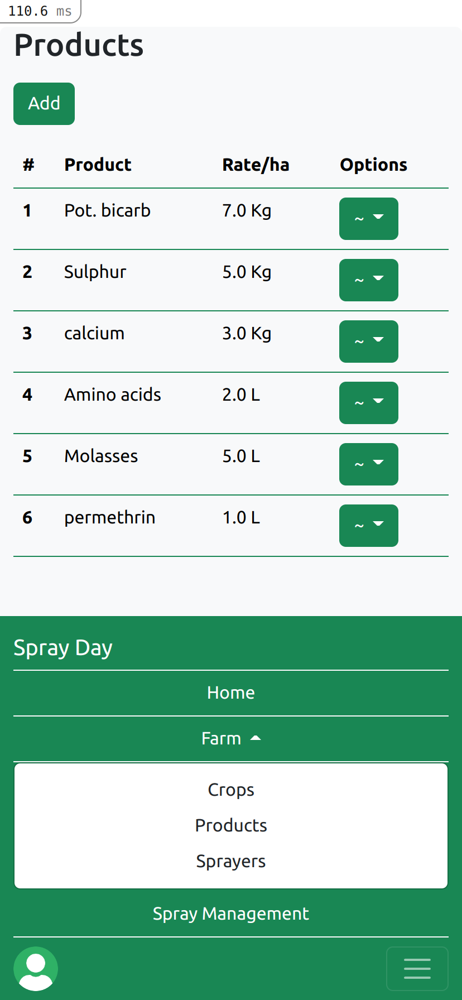
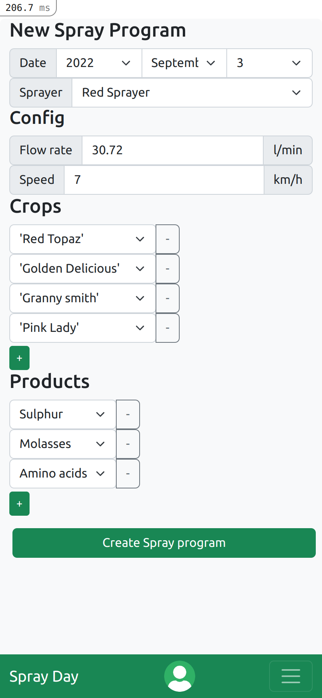
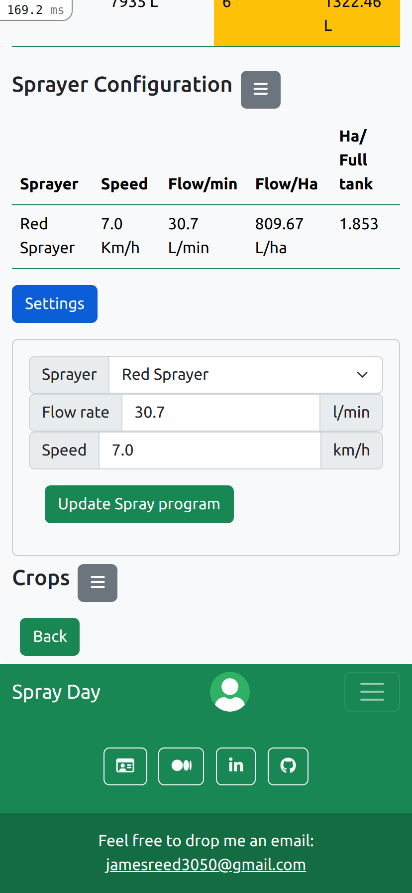
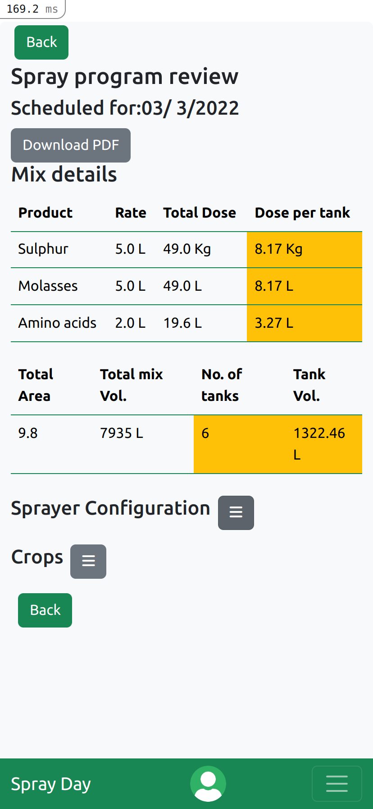

# Spray Day
Check out the initial version here, I've just migrated it to aws https://spray-day.click/

## Table of Contents
* [General Info](#general-information)
* [Technologies Used](#technologies-used)
* [Features](#features)
* [Screenshots](#screenshots)
* [Project Status](#project-status)
* [Room for Improvement](#room-for-improvement)
* [Acknowledgements](#acknowledgements)
* [Contact](#contact)
<!-- * [License](#license) -->

## General Information
- I spent some time helping to run an organic apple orchard a little while ago and wanted a way to make the job a little bit easier as it often involved doing several things at once including measuring things out precisely.
- Spray-day simplifies the process of setting up spray programs as once the details of the users farms and what products they want to be apply have been entered once, they are there ready to be selected again.
-Spray-day is mobile responsive and lets a job usually done at a desk be carried out anywhere while still providing records
- This project gave me a good opportunity to solidify my knowledge of Ruby on Rails and setting up a Postgres relational database and taught me how to deploy a rails app to a remote linux server (AWS EC2)

## Technologies Used
- Ruby on Rails 6
- Amazon Web Services
- Postgres
- HTML-5
- CSS-3

## Features
- Mobile responsive
- Lightweight fast frontend for practical users
- Accurate spray calculations anywhere

## Screenshots

</img> </img> </img> </img>

## Project Status
Project is: _in progress_ On hold for now as the basic functionality works. Until I'm ready to spend some money on hosting I cant implement the pdf download feature

## Room for Improvement

To do:
- Implement product type and recommended mix order
- Pdf download in production

## Acknowledgements

- This project was inspired by my time at Rudford Farm
- Calculations and information about air assisted spraying in orchards are available here:
  [Sprayers-101](https://sprayers101.com/)

## Contact
Created by [James Reed](https://www.linkedin.com/in/jamesreed91/) - feel free to contact me!

